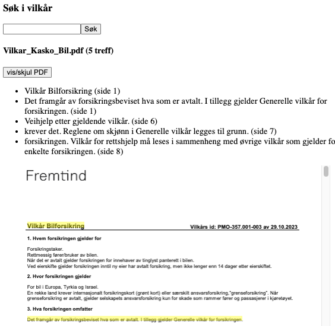
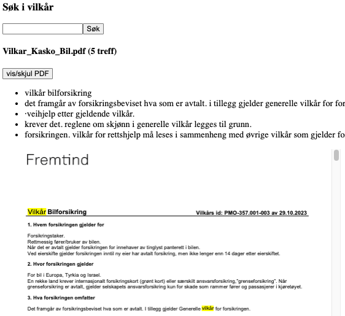

### Logg

#### 21-Sep-2025 / Frontend og hopp-til-match i PDF
 - Ny flyt i visning av informasjon: (1) dokumenter med treff vises først og (2) match/PDF vises først når et dokument er valgt. 
 - Styrer navigasjon ved klikk på dokument (vis/skjul detaljer) og snippet (hopp-til-match). Tatt i bruk en veldig enkel styles.css for styling av knapper og hover-effekt. 
 - State for å styre visning av detaljer er løftet opp til SearchResults. SearchResultItem bruker props for å vise/skjule detaljer. En del problemer med hopp-til-match i PDF hvis flere dokumenter er åpne på samme gang. Løst dette ved å kun la et dokument om gangen være åpent.  
 - Lokal state for "jumpToMatch" i SearchResultItem. Ved klikk på snippet sendes en string med sidenummer og x/y-koordinater videre til PdfViewer (id for å finne element).
 - Lagt til en id-property på samme div som representerer hver highlight sånn at PDF-en kan hoppe til riktig match.
 - Bruker en "useEffect" som lytter etter nytt klikk på en snippet - da hentes riktig element via id-property og PDF-visning hopper til riktig match via ".scrollIntoView". Hadde opprinnelig tenkt hopp-til-side, men det gir bedre mening å bruke spesifikke koordinater (kan da f.eks. vise frem en mer kompakt PDF og fremdeles få korrekt scroll).

#### 18-Sep-2025 / Ny highlight
 - Byttet ut tidligere løsning for highlight av søketreff (opplevde denne som rotete med tanke på rendering av text-layer i tillegg til canvas-layer).
 - Nå fungerer highlight slik: (1) hver Page-komponent fra react-pdf er wrapped i en relativ posisjonert div og (2) for hvert match-objekt så plasseres en absolutt posisjonert div på koordinatene for hver treff/snippet.
 - Justeringer med tanke på PDF/CSS-origo: PDF (x, y) fra nederst venstre og CSS (x, y) fra øverst venstre. Henter først ut høyde for en side (dette er tilgjengelig via "onRenderSuccess" per Page-komponent). Dette brukes videre for å plassere highlight-div riktig med justering av "top".
 - I JSON fra backend så er ikke sidenummer og koordinater sammen - lagd en funksjon "matchesToHighlight" som returnerer en array med objekter - der hvert objekt inneholder sidenummer og koordinater for hver søketreff som skal utheves. 
 - Opplevd en del problemer med at appen crasher hvis flere PDF-er vises frem og nytt søk blir gjort. Løst dette ved å legge til en "useEffect" i SearchResultItem-komponent som lytter etter nytt søk/query og lukker visning av alle åpne PDF-er. 
 - Ved søk på f.eks. "vilkår" så ser highlight slik ut (snippet utheves, ikke bare søkeordet): <br>
  


#### 13-Sep-2025 / Ny PDF-parser og frontend-justeringer
 - Tatt i bruk pdfjs-dist i backend for å hente ut sidenummer og koordinater på en ryddigere måte.
 - Dokumentasjon/offisiell repo for pdf.js ([her](https://github.com/mozilla/pdf.js)).
 - Største forskjellen mellom pdf-parse (brukt tidligere) og pdfjs-dist er i hvordan tekstdata hentes ut. Pdf-parse returnerer et objekt der "text"-property inneholder all tekst på alle sider slått sammen i en string, mens pdfjs-dist fungerer på en side-per-side basis.
 - Med pdfjs-dist så brukes først "getDocument" for å laste inn en "PDFDocumentLoadingTask" - med await/promise gir dette et "PDFDocumentProxy"-objekt. Når ".getPage(n)" kalles så returneres et "PDFPageProxy"-objekt per side. Deretter kan da ".getTextContent()" brukes for å få tilgang til en array of items.
 - Etter en del testing - hver PDF er bygget opp der "item.str" ofte representerer en chunk med tekst per linje/tekst per cell i tabell/bullet point/line break/annen formatering. I hver item finnes også bredde/høyde samt en transform-array (der index 4/5 representerer x/y koordinater for startposisjon av tekst). Eksempel på et item-objekt:
    ```
    {
      str: 'Maskinskade dekker tilfeldig og plutselig skade på:',
      dir: 'ltr',
      width: 204.58164204000005,
      height: 9,
      transform: [ 9, 0, 0, 9, 45.36019999999999, 168.4801 ],
      fontName: 'g_d2_f2',
      hasEOL: false
    }
    ```
- Overordnet logikk til parser i utils.ts: (1) for...of loop som tidligere over alle PDF-er, (2) for loop over alle sider fra "numPages" og (3) for...of loop over items-array fra ".getTextContent()". Per nå bygges selve JSON-objektet (returneres som "results") som sendes videre til frontend direkte i parsern. Definert strukturen i types.ts. Litt usikker på om jeg burde splitte dette opp (f.eks. la parsern kun hente ut rå data og strukturere JSON-objektet separat - fikk nåværende løsning til å fungere, så starter med dette).
- Gjenbruker samme regex-test som tidligere, denne kjøres nå mot "item.str". Dvs - per nå hentes koordinater ikke for selve søkeordet, men for hele linjen med tekst (snippet). Antall treff per dokument hentes opp under "count".
- Oppdatert frontend-komponenter/types.ts (samme som i backend) for å håndtere ny struktur på innkommende JSON.  


#### 08-Sep-2025 / Revurdering av PDF-parser i backend
 - For å bygge videre funksjonalitet som lar brukeren f.eks. trykke på en snippet og deretter vises riktig side med søkeord highlighted så trenger jeg sidenummer per match (også koordinater hvis jeg fremover endrer på hvordan highlight vises). Backend sender per nå ikke dette eller har enkel mulighet for det (via pdf-parse). Har prøvd noen alternativer for å ekstrahere sidenummer i frontend (regex-test på spans for å så finne frem til div som inneholder sidenummer/koordinater). På sikt, ikke en veldig robust måte å løse dette på - blir da avhengig av react-pdf sin rendering av text-layer vs canvas-layer osv. Blir mer ryddig å ta i bruk en pdf-parser i backend som bedre støtter det jeg trenger av data i frontend - her ser pdfjs-dist ut som et bedre alternativ. 

#### 06-Sep-2025 / Highlight av søkeresultat i PDF
 - En del problemer med å få til highlights av søkeresultat i rendered PDF. Vurdert/testet noen alternativer: (1) Python virker å ha et bra/bedre økosystem for prosessering av PDF-er (via f.eks. PyMuPDF/pypdf) - her med tanken om å la backend generere en tilfeldig/ferdig highlighted PDF som frontend bare kan vise frem, (2) dyke ned i pdf.js-dokumentasjon og prøve å bygge noe fra bunn. Begge to virket som unødvendig komplekse. Fant til slutt "customTextRenderer" i dokumentasjonen til react-pdf ([her](https://github.com/wojtekmaj/react-pdf)) som tillater søk/regex i text-layer og injeksjon av mark-tags (highlights) som vises frem i canvas-layer.
 - Utvidet PdfViewer-komponent med highlightQueryMatches-funksjon som kjører regex (samme logikk som i backend/utils.ts) på selve søkeordet og erstatter dette med søkeord + highlight i gult. Hvis match er i en del av PDF-en som er i bold font så vil ikke dette vises i samme stil. Ser ikke veldig pent ut, men starter med dette foreløpig. <br>
  
 - Sender også query={resMessage.query} som prop fra SearchResults-komponent videre sånn at søkeordet kan brukes i PdfViewer-komponent. 
 - Ny build viser GitHub languages stats som +99% JS. React-pdf dokumentasjon nevner bruk av extern CDN for pdfjs-worker - endret til dette for å ikke inkkludere worker i build (hentes nå ved runtime). GitHub stats vises nå som tidligere. 

#### 03-Sep-2025 / Sortering av søkeresultat og ny visning av PDF
 - Søkeresultat rangeres nå etter treff per dokument (flest treff først).
 - Vurdert pdf.js, react-pdf og react-pdf-viewer. Sistnevnte trenger betalt lisens og pdf.js virker unødvendig granular/kompleks med tanke på formål. Tar i bruk react-pdf fremover. 
 - Initialt react-pdf oppsett fra [her](https://github.com/wojtekmaj/react-pdf/blob/main/sample/next-pages/pages/Sample.tsx) (visning av hele dokumentet) - med noen justeringer: (1) display som "inline-block", liten "height" og "overflowY: auto" for å få opp scrollbar, (2) fjernet visning av antall sider, (3) fjernet visning av text-/annotation-layer.

#### 02-Sep-2025 / Rendering av PDF og nye komponenter
 - Undersøkt forskjellige måter å vise PDF-er på. På sikt så virker react-pdf/pdf.js som et bra alternativ med tanke på utheving av søkeresultat. Starter med enkel iframe-tag for å se sånn at alt annet fungerer.
 - Lagt til get-route i pdf.ts for å hente det relevante dokumentet og splittet routes i separate filer (search.ts og pdf.ts nå i /routes).
 - Lagt til PdfViewer-komponent som bruker iframe-tag for å render PDF. 
 - Flyttet rendering av treff per dokument over til ny SearchResultItem-komponent. Også lagt til knapp/bool useState for å vise/skjule PDF-en. 

#### 31-Aug-2025 / JSON-struktur og conditional rendering i frontend
 - Korrigert feil i types.ts. Opprinnelig var "document" definert som et objekt. Lagt til [] for å indikerer at dette er en array av objekter.
 - Justert SearchResults-komponent: (1) tidlig exit hvis innkommende JSON/resMessage er null, (2) bool via .some() for å kontrollere hvis søkeord er match/ikke-match (sånn at !searchMatch/searchMatch kan brukes i conditional rendering), (3) .filter() før .map() for å kun render dokumenter med treff. 
 
#### 30-Aug-2025 / Søkeord i kontekst, flere PDFer og rendering av søkeresultat
 - Vurdert forskjellige måter å vise match av søkeord i en enkel kontekst/snippet. Prøvd f.eks. å utvide regex-logikk med søkeord +/- x antall chars og inkludering av hele linjer. Holder meg til å bare vise hele linjen med tekst der søkeordet matcher foreløpig.
 - Lagt til flere PDFer i /data. 
 - Utvidet utils.ts med en findPdfs-funksjon som henter ut filnavn på alle dokumenter som ligger i /data. Endret i logikken til parsern: looper over alle PDFer, splitter parsed tekst og kjører regex-test per linje. Etter hver loop samles "filename", "count" og "matches" i results ("document" i selve JSON-objektet). Per nå sendes dette til frontend ved søk på f.eks "dekk":
    ```
    {
      "status": "OK",
      "query": "dekk",
      "document": [
        {
          "filename": "Vilkar_Kasko_Bil.pdf",
          "count": 2,
          "matches": [
            "·ekstra dekk og felger tilsvarende det antall hjul  ",
            "dekk og felger som ikke er skadd."
          ]
        },
        ...
      ]
    }
    ```
 - Utvidet frontend med SearchResults-komponent og flyttet alt av rendering over dit. Oppdatert types.ts sånn at SearchResult-type matcher innkommende JSON-objekt fra backend.

#### 27-Aug-2025 / Data, pdf-parse og JSON til frontend
 - Lagt til vilkårsdokument/PDF for Toppkasko bil i backend under /data. 
 - I første omgang så er fokus ekstrahering av rå tekst, tatt i bruk pdf-parse da det virket som et godt alternativ. Laget en PDF-parser i utils.ts som leser inn PDFen, parser tekst og henter ut dokumentnavn, antall treff på query og en array med alle treff. Tatt i bruk parsing-funksjon i server.ts som sender et utvidet JSON-object til frontend. 
 - Definert types for SearchResult/innkommende JSON-objektet i types.ts.
 - Foreløpig vises kun selve JSON-objektet direkte i frontend med JSON.stringify.
 - Justert build scripts: frontend /dist kopieres til backend /public med "copy-build-to-backend" og backend "build" flytter også /data med PDF over til /dist. 

#### 26-Aug-2025 / Søk fra frontend og respons fra backend
 - Utvidet frontend med en SearchBar-komponent som er ansvarlig for å håndtere input fra bruker i lokal state. Selve søket/query sendes til parent app.tsx som tar seg av interaksjon med backend. Ved OK/200 respons fra backend så presenteres også selve søket her foreløpig. Har i tillegg lagt til en server proxy i vite.config.ts.
 - Justert /search-endpoint i backend sånn at den lytter etter GET-request og sender JSON tilbake til frontend. 

#### 25-Aug-2025 / Backend
 - Laget enkel ping-endpoint i server.ts som senere skal brukes til å håndtere søk fra frontend. Korrigert og ryddet i index.ts. Også justert build-script sånn at ny /dist lages per auto (ny prod-versjon som fungerer). 

#### 24-Aug-2025 / ESM vs CommonJS og veien videre
 - Oppdaget at backend ESLint feiler ved kjøring av lint-script (terminal anbefaler "type": "module" i package.json). Av det jeg lest så virker ESM/frontend og CommonJS/backend som en vanlig konfigurasjon så holder meg til dette. Enklest løsning virker å bli endring av filnavn (.mjs) sånn at backend kan holdes med CJS. 
 - Vurdert litt forskjellige alternativer rundt prosessering av PDFer og visning av søkeresultat i frontend. Initielt var tanken noen form for pre-prosessering/parsing av dokumentene og visning av selve PDF-dokumentet med matchende søk uthevet. I første omgang så starter jeg med et dokument og ekstrahering/visning av søkeresultat som rå tekst - bygger videre derifra. 

#### 23-Aug-2025 / ESLint
 - Konfigurert ESLint og tatt i bruk stylistic-plugin. Beholder mye av default settings, men spesifisert en del rules. Vurdert bruk av prettier, men tenker det gir bedre mening med kontinuerlig feedback og gjøre alt av korrigeringer manuelt underveis. Setter alle rules som "error" til å starte med. 

#### 22-Aug-2025 / Rydding
 - Fjernet default Vite boilerplate og laget ny minimal frontend som kan bygges videre på. 

#### 21-Aug-2025 / Initielt oppsett og render.com
1. Opprettet skjelett for frontend med vite@latest (React + TS) og backend (node + express).
2. Konfigurert build scripts: innehold fra frontend /dist kopieres manuelt over til backend /public for tilfellet (for å holde build-filene separert). Endret index.ts i backend sånn at statisk build-fil fra front kan serves. Også lagt til en SPA-fallback her. 
3. Ønsker at appen skal være lett tilgjengelig utenfor eget/lokalt miljø. Tatt i bruk og konfigurert en web service via render.com for å deploy initielt oppsett. En del problemer med første deployment ("path-to-regexp" fra Render-logg). Problem løst til slutt med å endre til dynamisk portbruk (process.env.PORT || 3000) og nedgradert fra express v5 -> v4 (wildcard routing).

#### 07-Aug-2025 / Initiale tanker (2)
 - _Data_ / Starter med personbil for privatkunde (4x PDFer: ansvar/mini-kasko/kasko/topp-kasko) og vurderer veien videre når jeg har en fungerende front/back. 
 - _Tech_ / Stor del av prosjektet vil ta læring fra [FullStackOpen](https://fullstackopen.com/en/) som utgangspunkt rundt valg av teknologier.
 - _UI-komponenter og prioriteringer_ / Kommer ikke bruke tid på å bygge/style komponenter manuelt, vil ta i bruk noen form for komponentbibliotek (tbd) - prioritet vil være en flyt og funksjonalitet som gir mening. 
#### 06-Aug-2025 / Initiale tanker
 - _Backend_ / Regner med at vilkårstekster ligger internt via en/flere APIer for å gjøre oppdateringer/endringer/produksjon av vilkårsdokumenter (PDFer) enkelt. Vil bruke offentlig og lett tilgjengelig informasjon (f.eks. Topp Kasko PDF personbil: https://dokument.fremtind.no/vilkar/fremtind/pm/mobilitet/Vilkar_Toppkasko_Bil.pdf). Tanken er å samle flere dokumenter på et sted (tbd), lage en backend som henter dokumentene og en frontend som presenterer resultat av et søk på en enkel og oversiktlig måte. Det vil si, ved vilkårsendringer så må nyeste versjonen hentes og lagres manuelt. Anser dette ok i en proof-of-concept setting, men ville skalert dårlig i virkeligheten/på sikt. 
 - _Visuell layout og funksjonalitet_ / Et enkelt søkefelt (a), en oversikt over antall treffer per dokument (b). Mulighet for å expandere/minimere oversikt og lenke videre til fullsidesvisning av vilkårsdokument med søkeord highlighted (c). Vurdert kun extrahering/visning av rå tekst, men tenker at match av søkeord bør vises i full kontekst (dvs synlig i selve vilkårsdokumentet) - sånn at rådgiver ikke går glipp av noe viktig. 
